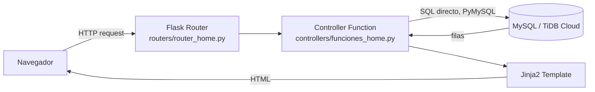

# Arquitectura del Sistema — BrokerCore

## Visión general

BrokerCore es un **monolito Flask** estructurado en un patrón MVC loosely-coupled: las rutas actúan como controladores delgados, toda la lógica de negocio vive en funciones de controlador centralizadas, y las vistas son plantillas Jinja2.

El sistema no utiliza Blueprints de Flask, lo que significa que toda la aplicación se define en un único conjunto de archivos de rutas y funciones. Esto simplifica el despliegue y el razonamiento lineal, a costa de escalabilidad modular.



---

## Estructura de archivos y responsabilidades

```
broker-suite/
├── app.py                    ← Crea la instancia Flask, carga .env y define app.secret_key.
├── run.py                    ← Entrada para desarrollo. Registra routers, define el context processor de pólizas pendientes, e inicia Flask en puerto 5600 con debug=True.
├── wsgi.py                   ← Entrada para producción. Registra routers e inicia waitress en el puerto de la variable PORT (por defecto 8000).
├── Dockerfile                ← Imagen de contenedor (python:3.11-slim), para despliegue portable alternativo a Render.
├── docker-compose.yml        ← Levanta el servicio `app` con las variables del `.env` local.
├── render.yaml               ← Configuración de despliegue en Render.com (producción actual).
├── .env / .env.example       ← Variables de configuración del entorno.
├── requirements.txt          ← Dependencias Python.
│
├── conexion/
│   └── conexionBD.py         ← Fábrica de conexiones PyMySQL. Lee host/usuario/contraseña de variables de entorno (DATABASE_URL/MYSQL_URL o las discretas DB_*), no de la sesión.
│
├── controllers/
│   ├── funciones_home.py     ← Toda la lógica de negocio (~8900 líneas). Una función por operación.
│   └── funciones_login.py    ← Lógica de autenticación y CRUD de usuarios de la aplicación (tabla `users`, sin cuentas MySQL asociadas).
│
├── routers/
│   ├── router_home.py        ← ~173 rutas de la aplicación. Cada ruta llama a una función de controller.
│   ├── router_login.py       ← Rutas de login, logout, recuperación de contraseña.
│   └── router_page_not_found.py ← Handler de error 404.
│
├── templates/public/         ← Plantillas Jinja2. Una carpeta por módulo.
│   ├── base_cpanel.html      ← Plantilla base con navbar, sidebar y bloque de contenido.
│   └── [modulo]/             ← index.html, create.html, edit.html, detail.html por módulo.
│
├── static/
│   ├── css/                  ← Estilos Sneat Bootstrap 5 y overrides personalizados.
│   ├── js/                   ← Scripts de ApexCharts, tablas y formularios.
│   ├── fotos_empleados/      ← Fotos de empleados subidas por el sistema.
│   └── downloads-excel/      ← Archivos Excel generados temporalmente.
│
├── BD/                       ← Archivos SQL del esquema y migraciones.
└── scripts/                  ← Scripts Python de migración puntual.
```

---

## Capa de autenticación

BrokerCore usa autenticación basada en la sesión firmada de Flask (`app.secret_key`, tomada de `SECRET_KEY`). La sesión guarda identidad y rol a nivel de aplicación — **no** credenciales de base de datos.

### Flujo de autenticación

```
POST /login   (routers/router_login.py)
    ↓
1. Conecta a la base de datos con connectionBD() (credencial única y compartida)
2. Consulta users WHERE email_user = ?
3. Verifica hash con werkzeug.check_password_hash
4. Si válido:
     session['conectado'] = True
     session['id'] = account['id']
     session['name_surname'] = account['name_surname']
     session['email_user'] = account['email_user']
     session['permisos'] = account['permisos']   ← rol de la app
```

### Conexión por request

```python
# conexion/conexionBD.py (simplificado)
def connectionBD():
    database_url = os.environ.get('DATABASE_URL') or os.environ.get('MYSQL_URL')
    # ...parsea host/user/password/db/port de la URL, o usa DB_HOST/DB_USER/DB_PASSWORD/DB_NAME/DB_PORT...
    return pymysql.connect(**connect_args)
```

La misma credencial de base de datos se usa para todas las requests, sin importar el usuario logueado ni su rol. El control de acceso por rol se resuelve comparando `session['permisos']` en cada ruta/template — no hay controles a nivel de base de datos (no hay GRANT/REVOKE por usuario). Limitaciones relacionadas están documentadas en [tecnico/seguridad.md](./seguridad.md).

---

## Capa de rutas

`router_home.py` contiene aproximadamente 173 rutas, todas registradas directamente sobre el objeto `app` de Flask (no hay Blueprints). El patrón es uniforme:

```python
@app.route('/lista-de-asegurado', methods=['GET'])
def listar_asegurados():
    if 'conectado' in session:
        data = funciones_home.get_asegurados()
        return render_template('public/asegurados/index.html', data=data)
    return redirect(url_for('loginCliente'))

@app.route('/form-registrar-asegurado', methods=['POST'])
def crear_asegurado():
    return funciones_home.crear_asegurado(request.form)
```

El control de acceso (login requerido, rol requerido) se hace verificando `session` directamente al inicio de cada función de ruta, no con un decorador reutilizable.

**Caso especial — códigos de póliza con barras:**
Los códigos de póliza (`cod_poliza`) pueden contener barras `/`, lo que genera conflictos en URLs de Flask. La solución adoptada es sustituir `/` por `-` al construir las URLs y revertir la sustitución en el controller antes de consultar la base de datos.

---

## Capa de lógica de negocio

`funciones_home.py` contiene toda la lógica de negocio en ~8900 líneas. No hay separación por módulo; todas las funciones coexisten en el mismo archivo.

Las funciones usan SQL directo (sin ORM):

```python
def get_asegurados(filtros=None):
    conn = connectionBD()
    cursor = conn.cursor()   # PyMySQL DictCursor: cada fila es un dict
    cursor.execute("SELECT * FROM asegurado WHERE ...")
    result = cursor.fetchall()
    cursor.close()
    conn.close()
    return result
```

No existe connection pooling: cada llamada abre y cierra una conexión nueva.

---

## Context processor

El context processor que inyecta el conteo de pólizas pendientes está definido en **`run.py`** (no en `app.py`):

```python
@app.context_processor
def inject_pending_count():
    if 'conectado' in session:
        return {'conteo_pendientes': obtener_conteo_polizas_pendientes()}
    return {'conteo_pendientes': 0}
```

`app.py` solo crea la instancia de Flask y define `app.secret_key`; no registra context processors.

> **Nota:** este context processor solo se registra cuando la aplicación arranca vía `run.py` (entrada de desarrollo). **`wsgi.py` (entrada de producción, usada por Render y por el `Dockerfile`) no lo registra.** Además, la variable `conteo_pendientes` no está referenciada en ninguna plantilla actualmente — es código que quedó sin consumidor tras los cambios recientes al sidebar de Comisiones. No representa un problema funcional hoy, pero es una inconsistencia a limpiar.

---

## Sistema de plantillas

Las plantillas extienden `base_cpanel.html` mediante herencia Jinja2:

```html


Asegurados


  <!-- contenido del módulo -->

```

La plantilla base incluye:
- Sneat Bootstrap 5 (navbar + sidebar responsivo).
- Bloque de scripts para ApexCharts (dashboard).
- Nombre y rol del usuario autenticado en el header.

---

## Despliegue

BrokerCore soporta dos rutas de despliegue en paralelo:
- **Render.com** — producción actual (`render.yaml`): `buildCommand: pip install --no-cache-dir -r requirements.txt`, `startCommand: python wsgi.py`, variables `SECRET_KEY` (generada), `DATABASE_URL` (secret manual) y `MYSQL_SSL=true`.
- **Docker** — alternativa portable (`Dockerfile` + `docker-compose.yml`): imagen `python:3.11-slim` con `ca-certificates` (necesario para TLS de PyMySQL contra TiDB), ejecuta `python wsgi.py`, expone `$PORT` (por defecto 8000).

Detalle completo en [tecnico/despliegue.md](./despliegue.md).

---

## Deuda técnica conocida

| Área | Problema | Impacto |
|---|---|---|
| `funciones_home.py` | ~8900 líneas en un solo archivo | Mantenibilidad crítica. Dificulta pruebas y cambios aislados. |
| Sin ORM | SQL directo en cada función de controller | Mayor verbosidad, sin migraciones automáticas, integridad referencial delegada a la aplicación. |
| Sin connection pooling | Nueva conexión PyMySQL por request | Overhead de red en alta concurrencia. |
| Sin Blueprints | Todo en dos archivos de rutas | Dificulta escalar el equipo o extraer módulos. |
| Sin CSRF | Formularios sin token CSRF | Vulnerable a ataques cross-site request forgery. |
| Sin tests | Cero cobertura de pruebas automatizadas | Riesgo alto ante refactorizaciones. |

Ver el detalle ampliado en [tecnico/limitaciones-conocidas.md](./limitaciones-conocidas.md) y el posicionamiento de seguridad en [tecnico/seguridad.md](./seguridad.md).
